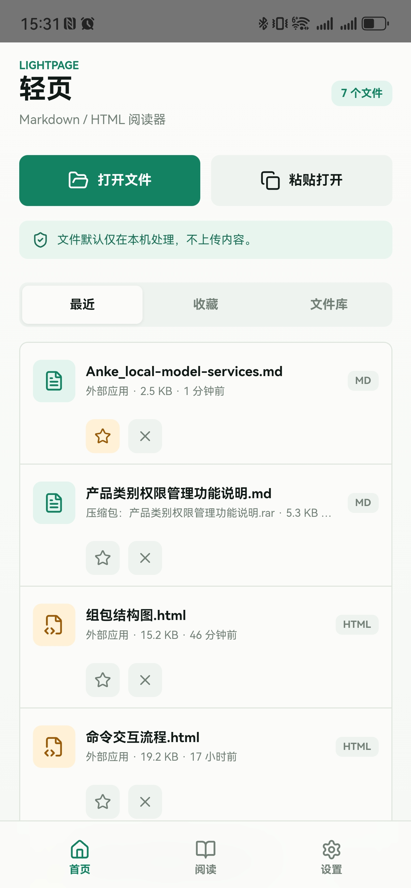
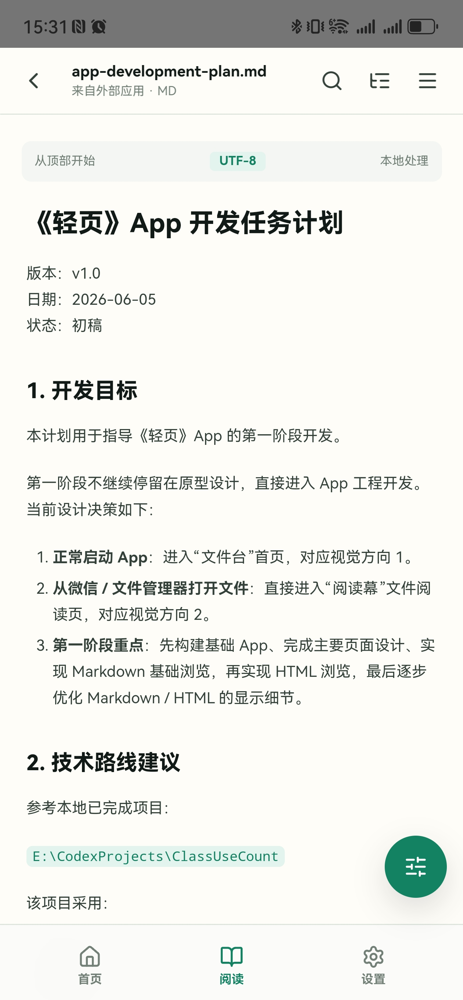
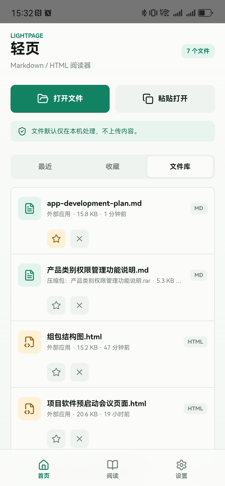
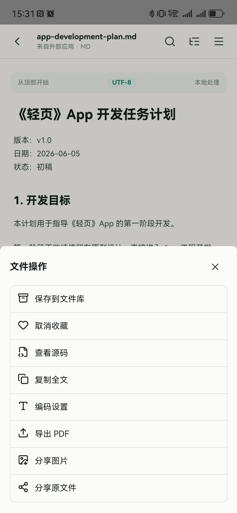

# 我用 Codex 把一个 App 从想法推到了可运行版本

坦率的讲，做轻页这个 App，一开始并没有什么宏大的产品叙事。

就是一个很具体、很烦、但又经常出现的小问题。

朋友在微信里发来一个 Markdown 文件，或者一个 HTML 报告。你点开，微信看不了。你想转给别人，格式又散了。你想在手机上快速扫一眼，结果要么打开方式不对，要么变成一坨源码，要么表格直接撑破屏幕。

这事儿很小。

但小到一定程度，就特别适合做成一个工具。

所以轻页，也就是 LightPage，最初的想法就这么简单，它不是一个编辑器，也不是云文档平台，更不是另一个笔记软件。

它就是一个手机端 Markdown 和 HTML 阅读器。

收到文件，直接打开。

打开之后，舒服阅读。

读完之后，可以搜索，可以看目录，可以调字号和主题，可以导出 PDF，可以分享图片，也可以把原文件继续转出去。

我觉得它最有意思的地方，不只是这个 App 本身。

更有意思的是，它几乎完整走了一遍我最近很喜欢的 AI 开发工作流。

从一个模糊想法，到软件需求文档，到界面原型，到静态页面，到开发计划，再到让 Codex 按计划一点点做完。

整个过程跑下来，我越来越觉得，AI 编程真正爽的地方，不是你跟它说一句帮我写个 App，然后它啪一下变出一个 App。

不是这样的。

真正爽的是，你可以把一个原本靠人脑硬扛的产品推进过程，拆成一段一段能被 AI 接住的任务。

每一段都不神奇。

但连起来，就有点离谱。

说回轻页。

它解决的问题其实非常典型，移动端有很多文件是给电脑准备的，但现在大量内容又会先在微信、邮箱、网盘、群聊里流转。

Markdown 是这样。

HTML 也是这样。

尤其现在大家用 AI 生成报告、会议纪要、技术说明、需求文档，很多时候导出来就是 `.md` 或 `.html`。电脑上很好办，浏览器、编辑器、预览器都能搞。

但到了手机上，体验一下子就断了。

轻页的第一条主路径，就是从这个断点开始的。

用户在微信或文件管理器里收到一个 Markdown 或 HTML 文件，选择用其他应用打开，然后轻页直接进入阅读页。

不是先让你看欢迎页，不是让你注册账号，也不是让你导入到某个工作区。

直接看。

这个产品的核心原则，需求文档里写得很清楚。

阅读优先，打开要快，本地优先，安全渲染，移动端友好，弱打扰，兜底可用。

这些词看起来都很朴素，但我觉得越是工具型 App，越需要这种朴素。

因为用户打开它的时候，通常不是来探索功能的。

他就是有个文件打不开。

你只要让他打开，就赢了一半。

轻页现在的首页叫文件台，里面有最近打开、收藏、文件库三个区域。你可以手动打开文件，也可以从历史记录里继续看之前的文档。

阅读页则更像一个很安静的阅读幕。

顶部保留返回、文件名、搜索、目录和更多操作。正文区域负责渲染 Markdown 或 HTML。底部和菜单里放阅读工具，字号、主题、源码视图、导出 PDF、分享图片、分享原文件、复制全文、文件信息、编码设置这些都在这里。

Markdown 这块，轻页支持常见语法和 GitHub Flavored Markdown，包括标题、列表、引用、表格、任务列表、代码块、图片和自动链接。代码块和表格会横向滚动，不会把手机页面撑炸。

HTML 这块更麻烦一点。

因为 HTML 不是单纯的内容，它里面可能有脚本、外部资源、跳转、下载，甚至还有各种相对路径资源。

所以轻页对 HTML 的处理不是简单把字符串塞到页面里，而是默认走安全沙盒。脚本默认禁用，外部资源会被处理和提示，渲染失败时还能切到源码视图。

这里有一个很现实的判断。

手机上打开一个别人发来的 HTML 文件，第一优先级不是炫技，而是别出事。

能读，安全，出错有兜底。

这三个点比任何花哨功能都重要。

再往下，就是文件记录和分享导出。

用户打开过的文件会进入最近打开。常用文件可以收藏。外部文件可以保存到 App 内文件库。阅读完可以导出 PDF，也可以分享当前可见区域为图片，还可以直接分享原文件。

这些功能看起来像锦上添花，但它们其实服务同一个场景。

把 Markdown 和 HTML 变成手机里真正能流转的东西。

你想想看，如果一个文档只能在 App 里读，不能变成 PDF，不能截图分享，不能转发原文件，那它在微信生态里就还是断的。

轻页要补的，就是这个断点。

然后聊聊这个 App 是怎么被做出来的。

这块我觉得比产品本身更值得记录。

我这次没有从写代码开始。

准确说，我是故意不从写代码开始。

因为一上来就让 Codex 写代码，很容易得到一个能跑但方向飘的东西。尤其是 App，里面涉及产品定位、页面层级、技术路线、权限、异常处理、构建方式、真机验证，一开始不说清楚，后面就会变成到处补洞。

所以第一步，是把初步想法丢给 Codex，让它先生成详细的软件需求文档。

这个动作很关键。

人脑里通常只有一句话，做一个手机端 Markdown 和 HTML 阅读器。

但 Codex 需要的是一整套可执行边界。

目标用户是谁。

第一版范围是什么。

P0 和 P1 分别有哪些。

首页有哪些模块。

阅读页有哪些操作。

外部文件怎么打开。

Markdown 要支持哪些语法。

HTML 怎么保证安全。

导出和分享做到什么程度。

异常和编码怎么兜底。

这些东西如果不先写下来，后面每写一个功能都会重新争论一次。

而一旦写成需求文档，它就变成了项目的地基。

不是一句灵感，而是一份可以反复对照的协议。

第二步，是把需求交给 Product Design，生成界面原型。

这一步我自己的感受很强。

因为很多时候我们说做一个工具 App，脑子里想的是功能，但用户真正感受到的是界面里的秩序。

首页是不是安静。

操作是不是集中。

阅读页会不会压迫正文。

搜索、目录、更多菜单这些入口是不是顺手。

一个手机 App 的体验，很多时候不是靠功能数量堆出来的，而是靠这些很细的布局判断撑起来的。

Product Design 给出的原型，不是最终答案。

它更像是把模糊想法变成可比较的几个方向。

然后人来选。

这一点我觉得特别重要。

AI 可以给方案，但不要把选择权完全交出去。

因为产品气质这件事，还是得由人来拍板。

轻页最后选的是一个偏安静、偏阅读、偏本地工具的方向。首页叫文件台，阅读页叫阅读幕，这两个意象也保留到了开发计划里。

第三步，是让 Codex 根据选中的方向构建静态原型页面。

这一步不是为了马上交付，而是为了提前暴露问题。

小屏幕上会不会挤。

文件名长了会不会溢出。

底部导航和阅读工具会不会打架。

操作菜单是不是太深。

Markdown 表格和代码块在手机上是不是真的能读。

这些东西只看需求文档是看不出来的。

必须让页面先站起来。

哪怕是假数据，也要站起来。

第四步，是让 Codex 生成开发计划文档。

这份文档我觉得是整个流程里最像项目管理的部分。

它没有直接说一口气做完 v1.0，而是把工作拆成 M0 到 M12。

M0 是工程初始化。

M1 是基础 App 壳与导航。

M2 是首页文件台。

M3 是外部文件打开入口。

M4 是基础 Markdown 浏览。

M5 是阅读页基础操作。

M6 是本地文件记录。

M7 是基础 HTML 浏览。

M8 是 HTML 安全与资源提示。

M9 是 Markdown 显示优化。

M10 是编码识别与异常兜底。

M11 是导出与分享。

M12 是 Android 构建与真机验证。

你会发现，这个拆法其实特别工程化。

它不是按页面拆，也不是按感觉拆，而是按风险和依赖关系拆。

先让工程能跑。

再让页面能走。

再让 Markdown 可读。

再接外部文件。

再做 HTML。

再处理安全、编码、导出、分享。

这个顺序非常重要。

如果一开始就冲着导出 PDF 和分享图片去做，很容易前面的基础阅读还没稳，就已经陷进一堆平台细节里。

第五步，是用 Goal 的方式让 Codex 按开发计划逐步完成。

这块有点像给 Codex 一个长期任务，而不是一次问答。

我不是每次都说你帮我写某个函数，而是让它沿着开发计划推进，读当前代码，判断下一步，修改文件，跑构建，发现错误，再修。

它会自己去看 `doc/software-requirements.md` 和 `doc/app-development-plan.md`。

会根据现有工程选技术路线。

会用 Vite、React、TypeScript、Capacitor Android 这套栈搭 App。

会接 `react-markdown` 和 `remark-gfm` 做 Markdown 渲染。

会用 Capacitor 和原生 Android 插件处理外部文件传入。

会补 HTML 沙盒、相对资源重写、搜索高亮、目录抽取、字号和主题持久化、分享和导出。

也会在每个阶段跑 `npm run build`、`npx cap sync android`、Gradle 构建，确保不是只写了看起来能跑的代码。

这就是我觉得 Codex 最适合的位置。

不是替你做产品判断。

而是在你已经把方向、约束、验收标准讲清楚之后，变成一个可以持续推进的工程搭档。

它会犯错。

真的会。

比如移动端文件 URI、微信打开方式、HTML 安全沙盒、PDF 导出、GBK 编码，这些地方都不是一句代码能解决的。

所以这套流程的最后一步，一定是测试和反馈。

不是让 AI 写完就结束。

而是装到真机上，看首页能不能正常进，看文件管理器能不能打开 `.md` 和 `.html`，看微信能不能调起轻页，看 Markdown 表格会不会溢出，看 HTML 会不会乱跳，看导出的 PDF 和图片能不能被微信接收。

每一个测试结果，都可以再喂回 Codex。

然后继续修。

这也是我这次最大的感受。

AI 开发不是把程序员变成许愿机。

它更像是把软件开发里很多原本靠经验硬撑的中间层，变成了可对话、可生成、可检查、可迭代的文档和代码。

过去一个人做 App，很容易卡在某个环节。

想法有了，但需求没写。

需求有了，但界面没想清楚。

界面有了，但开发计划太粗。

代码写了，但构建没跑。

功能做了，但验收标准没人对。

这些断点，每一个都不大。

但它们会慢慢耗掉一个项目的动能。

Codex 真正有用的地方，是它可以把这些断点补起来。

你给它一个想法，它能帮你变成需求。

你给它需求，它能帮你拆出计划。

你给它计划，它能帮你逐步实现。

你给它错误日志，它能帮你定位和修复。

你给它真机反馈，它能继续把产品往前推。

当然，这里有一个前提。

人不能消失。

人要负责判断这个 App 到底解决什么问题，要负责选择设计方向，要负责决定什么先做什么后做，要负责在测试时说这个体验不对。

AI 负责把这些判断落到文档和代码里。

我越来越觉得，未来个人开发者或者小团队做产品，可能会很依赖这种节奏。

不是一个万能提示词打天下。

而是一个非常朴素的流程。

初步想法 → Codex 生成软件需求 → Product Design 生成界面原型 → 人选择方案 → Codex 构建静态原型 → Codex 生成开发计划 → Goal 方式逐步实现 → 构建测试 → 反馈迭代。

看起来不玄学。

但好用。

因为它把创造一个 App 这件事，从一坨混沌，拆成了很多个可以被推进的小台阶。

轻页现在还不是一个完美产品。

它还有很多后续可以做的方向，比如更好的长截图导出、Markdown 编辑、HTML 转 Markdown、文件库全文搜索、更多主题、更多平台适配。

但它已经完成了最重要的第一步。

从微信和文件管理器里来的 Markdown 和 HTML，不再是手机里的尴尬文件。

它们可以被打开，被阅读，被搜索，被导出，被分享。

而对我来说，更重要的是，我通过这个项目确认了一件事。

用 Codex 做 App，不是跳过产品开发。

而是把产品开发里那些过去很容易被省略、被糊弄、被遗忘的环节，重新变成可以看见、可以讨论、可以执行的东西。

这件事很小。

但小工具就是这样。

它不需要改变世界。

它只要在某个具体时刻，让一个人少烦十分钟。

这就够了。

而如果 AI 能让我们更快地把这种小工具做出来，我觉得这事儿挺值得继续玩下去。

永远对世界保持好奇。
