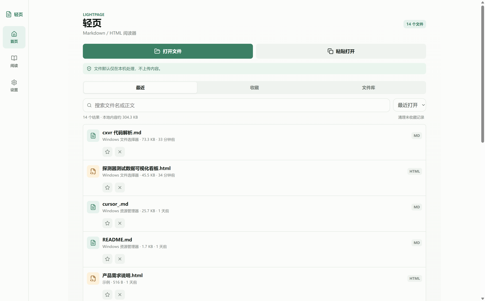
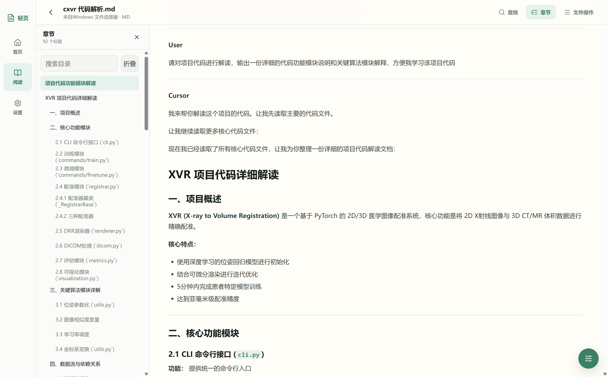
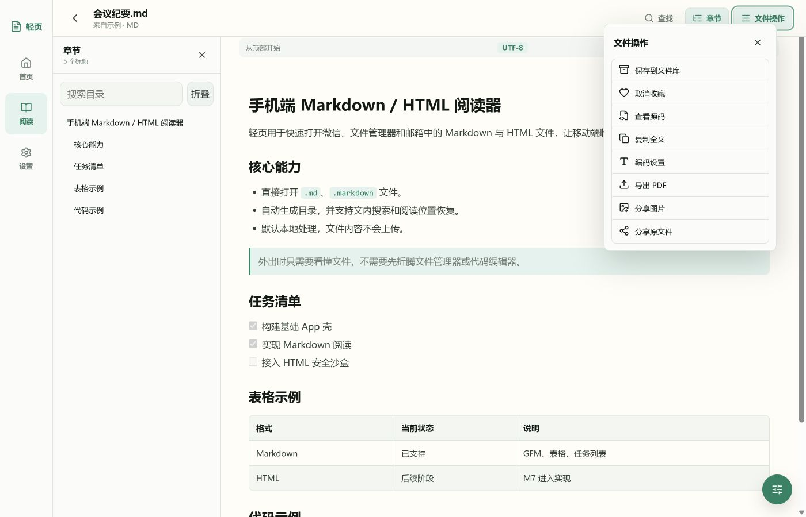
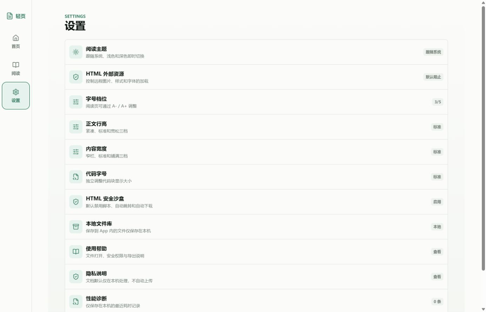

# 手机和电脑都能舒服看 Markdown：轻页 Android / Windows 完整使用指南

AI 普及之后，工作和生活里分享的 Markdown、HTML 越来越多，微信却都打不开，每次都要「用其他应用打开」，很折腾

**轻页（LightPage）** 就是为这件事做的：不是笔记软件，也不取代专业编辑器，只专注让 Markdown、HTML 和纯文本在 Android 与 Windows 上快速打开、安静阅读，并支持搜索、收藏、导出和分享。

*Android 版首页：打开文件、粘贴打开、最近记录、收藏和文件库都集中在一个页面。*

> 本文对应轻页 `1.1.2`。项目完全开源，下载、源码和问题反馈入口都放在文末。

## 轻页能做什么

轻页目前以 Markdown 和 HTML 阅读为主，纯文本可通过粘贴或渲染失败时的兜底视图打开。常用能力包括：

- Markdown 标题、列表、引用、表格、任务列表、代码块和自动链接
- GFM 语法、代码高亮、KaTeX 数学公式和 Mermaid 图表
- 自动生成章节目录，支持目录搜索和章节跳转
- 文内查找，并自动恢复上次阅读位置
- 浅色、深色和跟随系统主题
- 字号、行高、内容宽度和代码字号调整
- 最近阅读、收藏和本地文件库
- UTF-8、GBK、UTF-16、Latin-1 等编码切换
- 导出 PDF、当前区域图片、完整长图、分页长图和原始文件
- HTML 安全沙箱、远程资源限制和外部链接确认

Android 与 Windows 共用同一套核心阅读能力，但两个平台也各有侧重。

| 能力 | Android 版 | Windows 版 |
| --- | --- | --- |
| Markdown / HTML 阅读 | 支持 | 支持 |
| 纯文本粘贴与兜底视图 | 支持 | 支持 |
| 目录、搜索、主题与排版设置 | 支持 | 支持 |
| 最近、收藏与文件库 | 支持 | 支持 |
| 从其他应用直接打开文件 | 支持 | 支持 |
| ZIP / RAR 文档包导入 | 支持 | 暂不支持 |
| `.md` / `.markdown` / `.mdown` 文件关联 | 通过系统“打开方式” | 安装版可注册 |
| 导出图片、PDF 和原文件 | 支持 | 支持 |
| 界面布局 | 单栏移动阅读 | 桌面三栏阅读 |

一句话概括。

Android 版适合“别人刚发来一个文件，我现在就要看”；Windows 版适合“坐在电脑前，长时间阅读、搜索和跳转”。

## Android 版怎么用

### 第一步，下载并安装 APK

打开 [GitHub Releases 最新版本页面](https://github.com/ykath/FastViewer/releases/latest)，下载文件名中带有 `android` 的 APK。

当前 Android APK 使用调试证书签名，系统可能提示“未知来源应用”或安装风险。这并不代表文件一定有问题，但请务必只从项目的 GitHub Releases 页面下载。

如果手机中已经安装过使用其他证书签名的旧版本，可能无法直接覆盖。建议先备份需要保留的文件，再卸载旧版本并重新安装。

### 第二步，从微信、邮箱或文件管理器打开

收到 Markdown 或 HTML 文件后，点击文件的“用其他应用打开”，选择“轻页”。

轻页会直接进入阅读页，不要求登录，也不会先把文件上传到云端。

你也可以从轻页首页点击“打开文件”，手动选择：

- `.md`、`.markdown`、`.mdown`
- `.html`、`.htm`、`.xhtml`
- `.zip`、`.rar`

如果内容已经在剪贴板里，点击“粘贴打开”即可。轻页会自动判断它更像 Markdown 还是 HTML。

*Markdown 阅读页：标题层级、引用、列表、表格和代码块都会按阅读样式重新排版。*

### 第三步，用目录和搜索快速定位

长文最怕一直滑。

打开“目录”，轻页会根据文档标题自动生成章节列表。点击标题即可跳转；标题很多时，还可以直接搜索目录。

点击“搜索”后输入关键词，可以在正文中查找内容。退出后，轻页仍会记录上次阅读位置，下次打开可以接着看。

### 第四步，调整阅读样式

阅读页可以切换浅色、深色或跟随系统主题，还能调整字号、行高和内容宽度。

代码较多的技术文档，可以单独修改代码字号；表格和代码块在空间不足时支持横向滚动，不会把整个页面撑乱。

### 第五步，收藏、保存和导出

“最近”是访问记录，“收藏”方便标记常看内容，“文件库”则会把正文和原始文件持久保存到轻页的本地目录。

这三者不是一回事。

如果一份文件之后还要反复看，建议保存到文件库；如果只想留下入口，可以收藏；临时看过的内容留在最近记录即可。

*文件库：适合保存需要长期留在本机、以后还会继续阅读的资料。*

在文件操作菜单中，可以：

- 保存到文件库或加入收藏
- 切换阅读视图与源码视图
- 复制全文
- 修改编码
- 导出 PDF
- 分享当前画面、完整全文或分页长图
- 分享原始文件

*Android 文件操作：阅读、保存、导出和分享入口集中在同一个菜单中。*

## Windows 版怎么用

### 第一步，选择安装版或免安装版

同样打开 [GitHub Releases 最新版本页面](https://github.com/ykath/FastViewer/releases/latest)。

普通用户推荐下载 `windows-x64-setup.exe` 安装包。安装版可以注册 Markdown 文件关联，之后在资源管理器里双击 `.md`、`.markdown` 或 `.mdown` 文件就能直接打开。

如果不想安装，也可以下载 `windows-x64.exe` 免安装版。免安装版需要系统中已有 Microsoft Edge WebView2 Runtime。

当前 Windows 构建尚未进行代码签名，SmartScreen 可能显示安全提示。请核对下载来源确实是项目 Releases 页面，再决定是否运行。

### 第二步，打开或粘贴文档

启动后点击“打开文件”，选择 Markdown 或 HTML 文档。

也可以把 Markdown、HTML 内容复制到剪贴板，再点击“粘贴打开”。这种方式很适合临时查看 AI 生成的报告、会议纪要或代码说明，不必先新建文件。

*Windows 首页：左侧是主导航，中间集中展示打开方式、搜索、排序和文件记录。*

Windows 首页提供：

- 最近、收藏、文件库三种分类
- 按文件名或正文搜索
- 按最近打开、文件名或文件大小排序
- 查看本地文件数量和大致占用
- 清理未收藏的临时记录

### 第三步，使用桌面三栏阅读

Windows 版会充分利用宽屏空间。

左侧是主导航，中间是可搜索、可折叠的章节目录，右侧是正文。阅读长篇技术文档时，不用在目录和正文之间来回切页。

*Windows 原生程序实拍：章节目录与正文同时显示，代码块保持高亮，适合阅读较长的技术资料。*

顶部的“查找”用于搜索正文，“章节”控制目录显示，“文件操作”负责保存、编码、导出和分享。

*Windows 文件操作：保存、源码视图、编码设置、PDF、图片和原文件导出都可以直接进入。*

### 第四步，按自己的习惯调整设置

进入“设置”后，可以修改：

- 阅读主题
- HTML 外部资源权限
- 正文字号和代码字号
- 正文行高
- 内容宽度
- HTML 安全沙箱

这里也能查看使用帮助、隐私说明、性能诊断和当前版本号。

*Windows 设置页：阅读排版与 HTML 安全策略都可以单独调整。*

## HTML 文件为什么要多一道安全限制

Markdown 大多只是内容，HTML 却可能包含脚本、表单、弹窗、自动跳转、下载和远程资源。

因此轻页默认会把 HTML 放进安全沙箱：

- 脚本默认关闭
- 自动跳转和自动下载默认关闭
- 远程图片、样式和字体默认阻止
- 打开外部链接前会再次确认
- 独立 HTML 引用本地图片或 CSS 时，需要按文件授权目录

如果确定文件可信，可以按本次阅读临时放行所需资源。若页面渲染失败，也可以切换源码视图，至少先看到原始内容。

这套限制可能比浏览器直接双击 HTML 多一步，但面对聊天、邮件和网盘里来源不明的文件，多这一步是值得的。

## 大文件、乱码和压缩包怎么办

遇到问题时，可以先按下面的顺序处理。

### 文件超过 10 MB

10 MB 及以上文件默认使用源码模式，避免设备因为一次性复杂渲染而卡顿。确认设备性能足够后，再切换到阅读视图。

### 中文显示乱码

打开“编码设置”，依次尝试 GBK、UTF-16 或 Latin-1。重新选择正确编码后，轻页会再次解析正文。

### ZIP 或 RAR 无法打开

压缩包原生导入目前仅支持 Android。加密包、损坏包，或文件数量、解压体积超过安全限额的压缩包会被拒绝。

### HTML 图片或样式缺失

检查“HTML 外部资源”和“HTML 权限”。远程资源默认被阻止，本地相对资源也需要授权对应目录。

### Windows 双击文件没有使用轻页

优先安装 `windows-x64-setup.exe` 版本，然后在 Windows 的“打开方式”中把轻页设置为 Markdown 文件的默认应用。

## 隐私与本地数据

轻页的原则很简单：能在本机完成的，就在本机完成。

文档正文、搜索内容、阅读记录和性能诊断数据默认保存在本机，不会自动上传。删除记录时，关联的正文、归档资源和授权目录缓存也会一并清理。

收藏或已经保存到文件库的内容，不会被“清理未收藏记录”误删。

完整说明可以查看项目中的 [隐私说明](https://github.com/ykath/FastViewer/blob/main/doc/privacy.md)。

## GitHub 上这些链接分别有什么用

为了避免在仓库页面里绕来绕去，可以按下面这张关系表使用。

| 入口 | 用途 | 适合谁 |
| --- | --- | --- |
| [FastViewer 项目主页](https://github.com/ykath/FastViewer) | 项目介绍、功能概览、构建说明 | 所有人 |
| [最新版本下载](https://github.com/ykath/FastViewer/releases/latest) | 下载 Android APK、Windows 安装版和免安装版 | 普通用户 |
| [全部历史版本](https://github.com/ykath/FastViewer/releases) | 查看旧版本、发布记录和附件 | 需要回退版本的用户 |
| [问题反馈](https://github.com/ykath/FastViewer/issues) | 报告 Bug、提出功能建议 | 用户和测试者 |
| [使用帮助](https://github.com/ykath/FastViewer/blob/main/doc/user-help.md) | 文件打开、安全权限、导出与常见问题 | 遇到使用问题的用户 |
| [隐私说明](https://github.com/ykath/FastViewer/blob/main/doc/privacy.md) | 了解本地数据处理方式 | 关心隐私的用户 |
| [Android / Windows 源码](https://github.com/ykath/FastViewer/tree/main/mobile-app) | React 前端、Capacitor Android、Tauri Windows 工程 | 开发者 |
| [Android 构建脚本](https://github.com/ykath/FastViewer/blob/main/build-apk.bat) | 在 Windows 环境构建 APK | 开发者 |
| [Windows 构建脚本](https://github.com/ykath/FastViewer/blob/main/build-windows.bat) | 构建 x64 EXE 与安装包 | 开发者 |

它们之间的关系也很简单：

**项目主页看介绍 → Releases 下载软件 → 使用帮助解决常见问题 → Issues 提交仍未解决的问题 → 源码和构建脚本供开发者继续研究。**

反馈问题时，建议附上操作系统版本、轻页版本、文件类型和复现步骤。如果文件包含隐私或机密信息，不要直接上传原始文档，可以用脱敏后的最小示例代替。

## 最后

轻页做的不是一个宏大的产品。

它只是把一个很具体的断点补上了：从微信、邮箱、文件管理器或本地目录里拿到 Markdown 和 HTML 之后，不必再寻找编辑器，也不用把内容上传到另一个平台。

打开，读完，需要时导出或分享。

就这么简单。

如果你经常接收 AI 生成的报告、技术文档、会议纪要或项目说明，可以从 [GitHub Releases](https://github.com/ykath/FastViewer/releases/latest) 下载试试。

如果它帮你少折腾了几分钟，也欢迎在 [GitHub Issues](https://github.com/ykath/FastViewer/issues) 留下建议。
